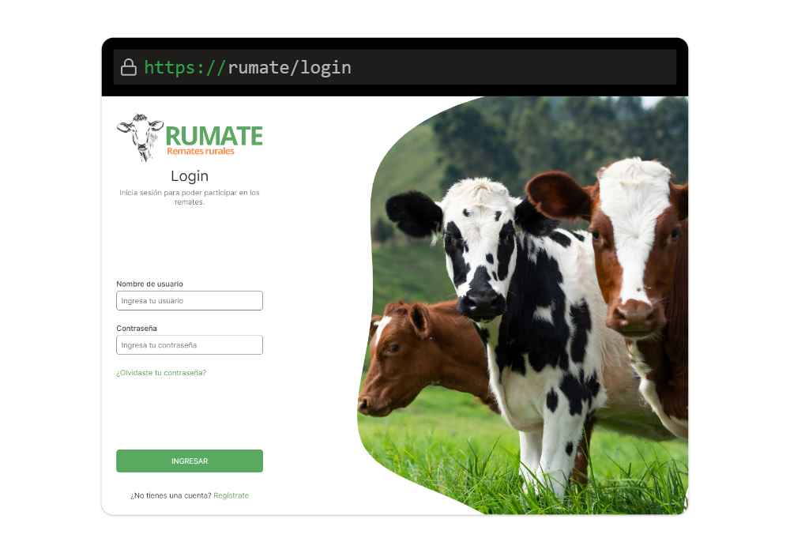

  <h3 align="center">RUMATE</h3>

  

    Una Nueva Versión de la Plataforma de Remates Rurales
  

## Sobre Rumate

Rumate es un proyecto personal que surge como una exploración de lo que podría haber sido un [proyecto de egreso](https://github.com/lew5/rumate-utu-2023) del curso de Informática con énfasis en Desarrollo Web de la UTU Maldonado - Escuela Técnica Superior de Maldonado. Aunque el proyecto original no alcanzó su objetivo final debido a limitaciones de tiempo, esta versión de Rumate representa un esfuerzo para demostrar el potencial de una solución integral para la gestión de remates rurales.

## Características Principales

- **Plataforma en línea**: Acceso remoto a información de remates y participación en ellos.
- **Gestión de usuarios y roles**: Diferentes niveles de acceso para administradores, empleados, compradores y vendedores.
- **Gestión de empleados**: Registro de horas trabajadas, asignación de tareas y gestión de pagos.
- **Registro de clientes**: Captura de información básica para clientes interesados en participar en remates.
- **Gestión de lotes**: Agregar, modificar y eliminar lotes, asignar precios de reserva y descripciones.
- **Gestión de pagos**: Pagos electrónicos seguros y métodos de pago confiables.
- **Seguridad de la información**: Encriptación de datos, contraseñas seguras y autenticación de usuarios.
- **Generación de reportes**: Informes y estadísticas de los remates para seguimiento y gestión.
- **Gestión de subastas**: Puja por lotes entre compradores interesados con ofertas en tiempo real.
- **Catálogo de productos**: Catálogo digital con descripciones detalladas y fotos de los productos a rematar.
- **Programación de remates**: Configuración anticipada de remates con opciones personalizadas.
- **Historial de remates**: Registro y seguimiento de remates realizados.
- **Marketing y publicidad**: Promoción de remates y lotes a rematar a través de diversas herramientas de marketing.
- **Notificaciones**: Configuración de notificaciones personalizadas para mantener informados a los clientes.
- **Calificaciones y comentarios**: Permite a los clientes calificar y comentar sobre los productos adquiridos.
- **Registro de proveedores**: Registro de proveedores con información básica de la empresa.
- **Información detallada de los lotes**: Publicación de información detallada de cada lote a rematar.
- **Monitoreo de ventas**: Permite al proveedor monitorear las ventas de sus lotes.
- **Seguimiento de las pujas**: Seguimiento en tiempo real de las pujas en cada remate.
- **Subastas en vivo**: Realización de subastas en vivo con participación en tiempo real.
